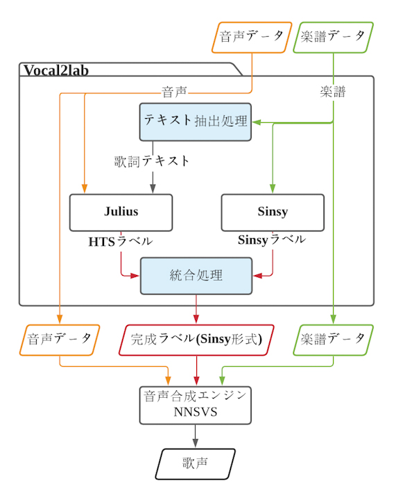

# Vocal2lab

<a href="https://github.com/r9y9/nnsvs">NNSVS（Neural network-based singing voice synthesis）</a>向けの教師データ作成を支援する自動ラベリングツールです。
 

<h1>動作環境</h1>

動作には以下の環境が必要になります。

<li>Windows</li>

<li>Python3</li>

<li>Perl</li>

<h1>使い方</h1>

<b>
留意事項</b>

Vocal2labは ./Vocal2lab/in/ 内のファイルに対してラベリングを行うことができます。

入力ファイル名は楽譜、音声共に同じ名前にして下さい。 入力形式は .musicxml（楽譜）.wav（音声）です。 出力形式は .lab（ラベル）です。
 

<b>現状、下記の要素を含む入力は正しくラベリング出来ません。
</b>

<li>21秒以上の音声</li>

<li>音割れしている音声</li>

<li>捨て仮名表記の発音が記入された楽譜 

　（小文字「ぁ,ぃ,ぅ,ぇ,ぉ」で表現される発音）</li>

<li>息継ぎ記号を含んだ楽譜</li>

<h2>1. セットアップ</h2>

※本ツールはCUIプログラムとなっています。

<b>
初回実行時のみ、管理者権限のターミナルで ./Vocal2lab/setup/ を開き、下記のコマンドを入力してください。 （必須PythonライブラリとSinsy音素辞書のインストールを自動で行います。）
</b>

    python ./setup.py
  

画像準備中

<h2>2. 実行方法</h2>

<b>一つだけラベリングを実行する場合。</b> 
    
    python ./Vocal2lab.py [入力ファイル名]　[出力ファイル名]

<b>（ラベルデータは ./out/　にラベル単体で保存されます。）</strong>  

<strong>一括ラベリングを実行する場合。</strong> 
    
    python ./Vocal2lab.py --multi

（オプション）出力サンプリングレートを48kHzに揃える場合。 
    
    python ./Vocal2lab.py --multi ds

<b>（ラベルデータは ./out/[実行日時]/　に楽譜、音声、ラベルのセットで保存されます。）</b>  

<b>コマンドリストを確認する場合。</b> 
    
    python ./Vocal2lab.py --help

 

<h2>3. ラベルの確認＆修正</h2>

出力ラベルは<a href="https://www.speech.kth.se/wavesurfer/man.html">WaveSurfer</a>で精度の確認と編集ができます。

<h1>Vocal2labの構成（開発者向け）</h1>

このツールは<a href="https://github.com/julius-speech/segmentation-kit">Julius segmentation-kit</a> を利用して音素ラベリングを実行しています。 

尚、構成は以下の図のようになっています。

 
    

今後の改善項目

<li>音声認識モデルの入力最大長の変更（現状20秒）</li>

<li>捨て仮名表記への対応</li>
